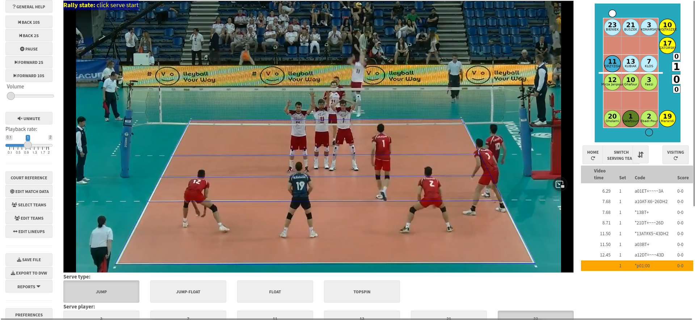

<!-- README.md is generated from README.Rmd. Please edit that file -->

```{r, include = FALSE}
knitr::opts_chunk$set(
  collapse = TRUE,
  comment = "#>",
  fig.path = "man/figures/README-",
  out.width = "100%"
)
```

# ovscout2

<!-- badges: start -->
[](https://www.tidyverse.org/lifecycle/#experimental)
![openvolley](https://img.shields.io/badge/openvolley-darkblue.svg?logo=data:image/svg%2bxml;base64,PHN2ZyB4bWxucz0iaHR0cDovL3d3dy53My5vcmcvMjAwMC9zdmciIHdpZHRoPSIyMTAiIGhlaWdodD0iMjEwIj48cGF0aCBkPSJNOTcuODMzIDE4Ny45OTdjLTQuNTUtLjM5Ni0xMi44MTItMS44ODYtMTMuNTgxLTIuNDQ5LS4yNDItLjE3Ny0xLjY5Mi0uNzUzLTMuMjIyLTEuMjgxLTI4LjY5Ni05Ljg5NS0zNS4xNy00NS45ODctMTMuODY4LTc3LjMyMyAyLjY3Mi0zLjkzIDIuNTc5LTQuMTktMS4zOTQtMy45MDYtMTIuNjQxLjktMjcuMiA2Ljk1Mi0zMy4wNjYgMTMuNzQ1LTUuOTg0IDYuOTI3LTcuMzI3IDE0LjUwNy00LjA1MiAyMi44NjIuNzE2IDEuODI2LS45MTgtLjE3LTEuODktMi4zMS03LjM1Mi0xNi4xNzQtOS4xODEtMzguNTYtNC4zMzctNTMuMDc0LjY5MS0yLjA3IDEuNDE1LTMuODY2IDEuNjEtMy45ODkuMTk0LS4xMjMuNzgyLTEuMDUzIDEuMzA3LTIuMDY2IDMuOTQ1LTcuNjE3IDkuNDU4LTEyLjg2MiAxNy44MzktMTYuOTcgMTIuMTcyLTUuOTY4IDI1LjU3NS01LjgyNCA0MS40My40NDUgNi4zMSAyLjQ5NSA4LjgwMiAzLjgwMSAxNi4wNDcgOC40MTMgNC4zNCAyLjc2MiA0LjIxMiAyLjg3NCAzLjU5NC0zLjE3My0yLjgyNi0yNy42ODEtMTYuOTA3LTQyLjE4NS0zNi4wNjgtMzcuMTUxLTQuMjU0IDEuMTE3IDUuMjQtMy4zMzggMTEuNjYtNS40NzMgMTMuMTgtNC4zOCAzOC45MzctNS43NzIgNDYuMDc0LTEuNDg4IDEuMjQ3LjU0NyAyLjIyOCAxLjA5NSAzLjI3NSAxLjYzIDQuMjkgMi4xMDcgMTEuNzMzIDcuNjk4IDE0LjI2NSAxMS40MjcuNDA3LjYgMS4yNyAxLjg2NiAxLjkxNyAyLjgxNCAxMS4zMDggMTYuNTY1IDguNjIzIDQxLjkxLTYuODM4IDY0LjU1Mi0zLjI0OSA0Ljc1OC0zLjI1OCA0Ljc0MiAyLjQ1IDQuMDE4IDMyLjQ4Mi00LjEyMiA0OC41MTUtMjEuOTM1IDM5LjU3OC00My45NzQtMS4xNC0yLjgwOSAxLjU2NiAxLjA2IDMuNTE4IDUuMDMyIDI5LjY5MyA2MC40MTctMjIuNTggMTA3Ljg1My03OS40OTggNzIuMTQzLTUuMDg0LTMuMTktNS4xMjMtMy4xNTItMy45MDIgMy44ODMgNC43MjEgMjcuMjIgMjUuNzgzIDQzLjU2MiA0NC4wODkgMzQuMjEgMS4zNjItLjY5NiAyLjIxLS43NSAyLjIxLS4xNDMtNi43NiAzLjg1Ny0xNi4wMTggNi41NTMtMjMuMTI2IDguMDkxLTcuNTU1IDEuNTQ3LTE4LjM2NiAyLjE3Mi0yNi4wMiAxLjUwNnoiIGZpbGw9IiNmZmYiLz48ZWxsaXBzZSBjeD0iMTA1Ljk3NSIgY3k9IjEwNC40NDEiIHJ4PSI5NC44NCIgcnk9IjkyLjU0MiIgZmlsbD0ibm9uZSIgc3Ryb2tlPSIjZmZmIiBzdHJva2Utd2lkdGg9IjEwLjc0Ii8+PC9zdmc+)
[](https://github.com/openvolley/ovscout2/actions/workflows/R-CMD-check.yaml)
<!-- badges: end -->

## About

This R package provides a Shiny app for scouting volleyball data files. At this stage it is entirely experimental. Beware!



## Principles

- scouting is always done from video, even when scouting a live match (though this is probably not actually possible yet). The hope is that we can make the user interface fast enough to be "nearly real time" - while the scout might lag behind the real action at times, they can catch up at the ends of rallies or other breaks in play
- by registering the corners of the court before scouting, we can map the court image to real-world court space. Clicking a location on the video can then be converted to its corresponding court coordinates. With a touch-screen device, this click interface can be reasonably fast
- the scouting process avoids unnecessarily asking for information (e.g. information that can be inferred by other means, such as the player next to serve), and tries to pre-fill as much information as it can at each data entry step. It will learn a team's patterns of play, so that it can suggest the most likely player to have attacked, passed or dug a certain ball

This software is intended for scouts who do not have access to professional scouting software or who aren't proficient with the keyboard interface that they typically use. `ovscout2` is an alternative to the many available tablet- and phone-based scouting apps that also use a click interface, but `ovscout2` provides more complete match data that is fully dvw compatible, and yet (we hope) remains easy to use. It is unlikely to replace professional scouting software used by scouts who can already capture match data in real time.

## Features

- a guided scouting interface that is easy to learn and ensures consistent data collection
- the interface can be tailored for simple or advanced scouting, with more details in the latter
- all contacts are recorded with precise locations (coordinates) as well as zones and subzones
- experimental support for dual match video cameras (one from either end of the court)

After you've scouted your match video, the data can be analyzed with the [openvolley](https://openvolley.org) suite of R packages, or with any other volleyball analytics software that takes dvw files as inputs.

## Installation

If you are not an R user, see the [user manual](https://ovscout2.openvolley.org/articles/ovscout2-user-manual.html) for standalone installers.

Otherwise:

```{r eval = FALSE}
install.packages("ovscout2", repos = c("https://openvolley.r-universe.dev",
                                       "https://cloud.r-project.org"))

## or

## install.packages("remotes") ## if needed
remotes::install_github("openvolley/ovscout2")

```

Two other system utilities are recommended but not required:

1. [pandoc](https://github.com/jgm/pandoc/) is required for generating match reports. If not present, the report generation menu won't be shown. If you are using RStudio, you do not need to install pandoc because RStudio comes bundled with its own copy. Otherwise install following <https://github.com/jgm/pandoc/blob/master/INSTALL.md>.

1. [lighttpd](https://www.lighttpd.net/) is a lightweight web server that is used to play the match video (when using a local video file). Install (from within R, on Windows only) using `ovscout2::ov_install_lighttpd()` or manually from <http://lighttpd.dtech.hu/> (for Windows) or via your package manager for other operating systems (see <https://redmine.lighttpd.net/projects/lighttpd/wiki/GetLighttpd>).
  If `lighttpd` is not installed, the app falls back to [servr](https://github.com/yihui/servr) but this is a little slower and less responsive than `lighttpd`.

## Usage

To try it on a short match video clip:

```{r eval = FALSE}
ov_scouter_demo()

```

To use with your own data:

```{r eval = FALSE}
ov_scouter(video_file = "/path/to/video.mp4", season_dir = "/path/to/existing/files")

```

If you don't provide the video file path, it will pop up a file navigator for you to select one. The season directory (a directory containing existing .dvw or .ovs files) can also optionally be provided. If a new match is being scouted, the teams can be selected from those in the season directory. You can also provide it with a partially-scouted `.dvw` or `.ovs` file, to continue scouting where you left off.

See `help("ov_scouter")` for more options, or the [user manual](https://ovscout2.openvolley.org/articles/ovscout2-user-manual.html).
