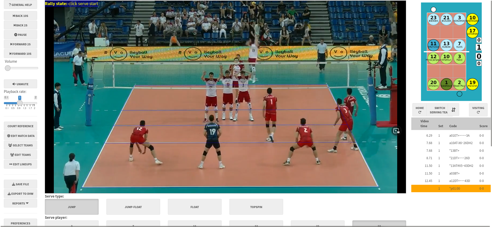

# ovscout2

## About

This R package provides a Shiny app for scouting volleyball matches to
produce detailed data files. It is free and open-source, with similar
functionality to the commercial DataVolley and VolleyStation software
packages.



Scouting can be done either with a guided point-and-click interface, or
by typing.

## Click-scouting principles

- scouting is always done from video, even when scouting a live match
  (though this is technically a bit tricky to set up). The hope is that
  the scouting process is fast enough to be “nearly real time” - while
  the scout might lag behind the real action at times, they can catch up
  at the ends of rallies or other breaks in play
- by registering the corners of the court before scouting, we can map
  the court image to real-world court space. Clicking a location on the
  video can then be converted to its corresponding court coordinates
- each ball touch is registered by clicking its location on screen. With
  a touch-screen device, this click interface can be reasonably fast
- to make the process faster and easier the app will pre-fill as much
  information as it can at each data entry step. It will learn a team’s
  patterns of play, so that it can suggest the most likely player to
  have attacked, passed or dug a certain ball

## Scouting by typing

- similar to the scouting interface through commercial software such as
  DataVolley or VolleyStation
- allows fast data entry, and can be used without a video if desired
  (this allows live matches can be scouted in real time by a scout who
  is physically present at the arena, without having to muck around with
  live video feeds)
- BUT type-scouting comes with a steep learning curve, which is why the
  click-scouting interface exists.

The click-scouting interface is for users who aren’t proficient with the
keyboard interface. While there are many tablet- and phone-based
scouting apps that also use a click-style interface, `ovscout2` provides
more complete match data that is fully dvw compatible and can be used
for advanced statistical analysis, and yet (we hope) remains easy to
use.

## Features of click-scouting

- a guided scouting interface that is easy to learn and ensures
  consistent data collection
- the interface can be tailored for simple or advanced scouting, with
  more details in the latter
- all contacts are recorded with precise locations (coordinates) as well
  as zones and subzones
- experimental support for dual match video cameras (one from either end
  of the court)

## Getting analysis results

After you’ve scouted your match video, you can generate a match report
directly from this app ([see an example
here](https://raw.githubusercontent.com/openvolley/ovscout2/master/man/figures/example-match-report-POL-IRI-WL2017.png)).
The data can be analyzed further with the
[openvolley](https://openvolley.org) suite of R packages, or with any
other volleyball analytics software that takes dvw files as inputs.

## Why this package?

Q: This seems awfully complicated! Why not just use one of the multitude
of apps available for phones and tablets, many of which have much
simpler (quicker) data entry methods?

A: If one of those apps meets your needs, by all means use it. But the
tradeoff with many of them is that the data being collected is limited,
and you will quickly reach the limit of the analysis questions that you
can answer. Some simple examples:

- if the data entry only allows you to record attack kills and errors
  (but not attack attempts that remained in play), you will not be able
  to calculate kill rates or efficiencies. If two players both had 10
  attack kills in a match, but one of them got their kills from 10
  attempts and the other from 30 attempts, wouldn’t you want to know
  that?
- if the data entry does not include attack start and end locations, you
  can’t generate attack direction maps (heatmaps) or setter
  distributions

The ovscout2 package is capable of collecting the same level of data
detail as professional scouting software, but also offers a simplified
data option that still allows a wide range of analysis questions to be
answered.

## Installation

If you are not an R user, see the [user
manual](https://ovscout2.openvolley.org/articles/ovscout2-user-manual.html)
for standalone installers.

Otherwise:

``` r
install.packages("ovscout2", repos = c("https://openvolley.r-universe.dev",
                                       "https://cloud.r-project.org"))

## or

## install.packages("remotes") ## if needed
remotes::install_github("openvolley/ovscout2")
```

Two other system utilities are recommended but not required:

1.  [pandoc](https://github.com/jgm/pandoc/) is required for generating
    match reports. If not present, the report generation menu won’t be
    shown. If you are using RStudio, you do not need to install pandoc
    because RStudio comes bundled with its own copy. Otherwise install
    following <https://github.com/jgm/pandoc/blob/master/INSTALL.md>.

2.  [lighttpd](https://www.lighttpd.net/) is a lightweight web server
    that is used to play the match video (when using a local video
    file). Install (from within R, on Windows only) using
    [`ovscout2::ov_install_lighttpd()`](reference/ov_install_lighttpd.md)
    or manually from <http://lighttpd.dtech.hu/> (for Windows) or via
    your package manager for other operating systems (see
    <https://redmine.lighttpd.net/projects/lighttpd/wiki/GetLighttpd>).
    If `lighttpd` is not installed, the app falls back to
    [servr](https://github.com/yihui/servr) but this is a little slower
    and less responsive than `lighttpd`.

## Usage

To try it on a short match video clip:

``` r
ov_scouter_demo()
```

To use with your own data:

``` r
ov_scouter(video_file = "/path/to/video.mp4",
           season_dir = "/path/to/existing/files")
```

If you don’t provide the video file path, it will pop up a file
navigator for you to select one. The season directory (a directory
containing existing .dvw or .ovs files) can also optionally be provided.
If a new match is being scouted, the teams can be selected from those in
the season directory. You can also provide it with a partially-scouted
`.dvw` or `.ovs` file, to continue scouting where you left off.

See [`help("ov_scouter")`](reference/ov_scouter.md) for more options, or
the [user
manual](https://ovscout2.openvolley.org/articles/ovscout2-user-manual.html).
